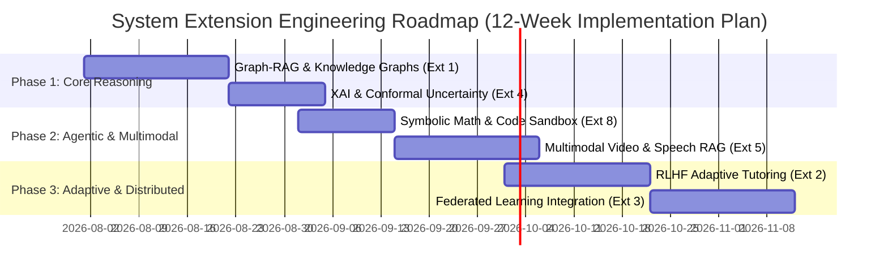

# 🚀 Advanced Research Extensions & Systems Architecture Plan
**Project Title:** AI Academic Learning Assistant — Distributed Ingestion & Intelligent Study Pipeline  
**Author:** Senior AI Researcher & Machine Learning Systems Architect  
**Date:** July 2026  

---

## 📋 Baseline Project Summary & Current Technical Foundation

Before proposing extensions, the table below documents the verified status and architecture of the existing baseline system:

| Section | Baseline Project Specification |
| :--- | :--- |
| **Project Name** | **Distributed AI Academic Learning Assistant** |
| **Current Objective** | Decoupled, distributed ingestion of multi-format academic documents (PDF, PPTX, TXT, MD) via Apache Spark & Kafka, storing dense vector embeddings in Qdrant, and exposing grounded RAG endpoints for Q&A (with page/slide citations), map-reduce summarization, structured JSON quiz generation, and Mermaid.js mind mapping. |
| **Dataset** | Academic slide decks (PPTX), course textbooks (PDF), lecture notes (TXT), and markdown documents (MD) across computer science and engineering domain courses. |
| **Current Technologies** | Python 3.10+, React (Vite, TailwindCSS, Mermaid.js), FastAPI, Apache Kafka, Apache Spark Structured Streaming, MinIO (S3 Object Storage), Qdrant Vector DB, `sentence-transformers` (`all-MiniLM-L6-v2`), Groq LLM API (`llama-3.1-70b-versatile`), PyMuPDF, python-pptx, Docker Compose. |
| **Current Model** | **Embedding Model:** `sentence-transformers/all-MiniLM-L6-v2` (384-dimensional dense vectors); **Generative Model:** `llama-3.1-70b-versatile` via Groq OpenAI-compatible endpoints. |
| **Current Results** | 99 automated test cases passing (100% pass rate) across FastAPI routers, Spark streaming batch processors, end-to-end integration tests, and performance benchmark suites demonstrating sub-second API query latencies. |

---

## 📊 Summary Matrix of 10 Proposed Extensions

The 10 extensions are ranked below by **Innovation & Research Depth** (1 to 5 Stars) and **Implementation Complexity** (1 to 5 Hammers). All proposals maintain feasibility for a 1-2 student project over a 4-12 week timeframe.

| Rank | Extension Project Title | Innovation | Difficulty | Primary Advanced AI Techniques |
| :---: | :--- | :---: | :---: | :--- |
| **1** | **Graph-RAG & Agentic Knowledge Graph Reasoning** | 🌟🌟🌟🌟🌟 | 🛠️🛠️🛠️🛠️🛠️ | Knowledge Graphs, Graph Neural Networks (GNN), Agentic AI, Multimodal RAG |
| **2** | **RLHF/RLAIF Adaptive Tutoring & Spaced Repetition Engine** | 🌟🌟🌟🌟🌟 | 🛠️🛠️🛠️🛠️ | Reinforcement Learning (PPO/DPO), Agentic AI, Spaced Repetition Policy |
| **3** | **Federated Privacy-Preserving Cross-Institutional Note Sharing** | 🌟🌟🌟🌟 | 🛠️🛠️🛠️🛠️ | Federated Learning, Edge AI, Differential Privacy, On-Device SLMs |
| **4** | **XAI Guardrails & Conformal Uncertainty Quantification** | 🌟🌟🌟🌟 | 🛠️🛠️🛠️ | Explainable AI (XAI), Conformal Prediction, Uncertainty Quantification |
| **5** | **Multimodal Speech-to-Slide & Lecture Video RAG Engine** | 🌟🌟🌟🌟 | 🛠️🛠️🛠️ | Vision-Language Models (VLM), Speech-to-Text (Whisper), Multimodal RAG |
| **6** | **Adversarial Fact-Checking & Paper Contradiction Resolver** | 🌟🌟🌟🌟 | 🛠️🛠️🛠️ | Agentic AI (Multi-Agent Debate), Claim Extraction Graphs, LLM-as-a-Judge |
| **7** | **Dynamic Knowledge Tracing using Graph Neural Networks** | 🌟🌟🌟 | 🛠️🛠️🛠️ | Graph Neural Networks (GCN/GAT), Deep Knowledge Tracing (DKT) |
| **8** | **Agentic Symbolic Math & Code Sandbox Execution Engine** | 🌟🌟🌟 | 🛠️🛠️ | Agentic AI (ReAct Loop), Symbolic AI (SymPy), Dynamic Code Execution |
| **9** | **Edge-Native Local AI Buddy with Quantized Local SLMs** | 🌟🌟🌟 | 🛠️🛠️ | Edge AI, Model Quantization (GGUF/AWQ), On-Device Vector Search (SQLite-vss) |
| **10**| **Bloom's Taxonomy Active-Learning Exam & Rubric Engine** | 🌟🌟 | 🛠️ | RLAIF, Self-Consistency Prompting, Automated Rubric Evaluation |

---

## 🔬 Detailed Proposal Breakdown (Extensions 1 to 10)

---

### 1. Graph-RAG & Agentic Knowledge Graph Reasoning Engine

#### 1. Real-World Problem Solved
Standard vector chunking slices documents naively by sentence or token count. It fails to capture multi-hop relations across distinct textbook chapters or documents (e.g., how a concept introduced in Chapter 2 relates to a proof in Chapter 8). Graph-RAG solves global concept synthesis and cross-document reasoning.

#### 2. Advancement Over Baseline
Replaces flat vector retrieval (`all-MiniLM-L6-v2` cosine similarity) with a dual-index architecture combining vector embeddings with an automatically extracted Entity-Relation Knowledge Graph (Neo4j / NetworkX) processed via Graph Neural Networks (GNN).

#### 3. Modern AI Techniques
- **Knowledge Graphs (KG)**
- **Graph Neural Networks (PyTorch Geometric / GraphSAGE)**
- **Agentic AI (LangGraph multi-agent graph traverser)**
- **Large Language Models (LLMs)**
- **Retrieval-Augmented Generation (RAG)**

#### 4. Student Project Feasibility
Highly feasible using open-source tools: Neo4j Desktop or NetworkX, PyTorch Geometric, and LangGraph. Runs on a single laptop with an RTX 3060/4060 or Google Colab free tier.

#### 5. System Utility
Enables students to ask complex global synthesis questions such as: *"Trace how the concept of backpropagation connects to transformer attention mechanisms across my Deep Learning slides and Math notes."*

#### 6. Complete System Architecture
```
┌────────────────┐     ┌────────────────────────────────────────────────────────┐
│ PDF/PPTX/Notes │───▶ │ Spark Ingestion: OpenIE Entity/Relation Extraction      │
└────────────────┘     └───────────────────────────┬────────────────────────────┘
                                                   │
                       ┌───────────────────────────┴───────────────────────────┐
                       ▼                                                       ▼
            ┌─────────────────────┐                                 ┌─────────────────────┐
            │ Qdrant Vector DB    │                                 │ Neo4j Knowledge Graph│
            │ (Dense Chunks)      │                                 │ (Entities & Edges)  │
            └──────────┬──────────┘                                 └──────────┬──────────┘
                       │                                                       │
                       └───────────────────────────┬───────────────────────────┘
                                                   │
                                                   ▼
                                ┌────────────────────────────────────┐
                                │ PyTorch Geometric (GNN Node Embed) │
                                └──────────────────┬─────────────────┘
                                                   │
                                                   ▼
                                ┌────────────────────────────────────┐
                                │ Agentic Graph Traverser (LangGraph)│
                                └──────────────────┬─────────────────┘
                                                   │
                                                   ▼
                                ┌────────────────────────────────────┐
                                │ Grounded Answer with Graph Paths   │
                                └────────────────────────────────────┘
```

#### 7. Additional Datasets
- **Open Academic Graph (OAG)** / **S2ORC (Semantic Scholar Open Research Corpus)**
- **Wikidata API** for concept grounding

#### 8. Required Technologies
- **Graph Databases:** Neo4j / NetworkX
- **GNN Library:** PyTorch Geometric (PyG)
- **Agent Framework:** LangGraph / AutoGen
- **Vector DB:** Qdrant (Existing)

#### 9. Implementation Steps
1. Parse text using Spark UDFs and execute OpenIE (Open Information Extraction) via SpaCy / LLM to output triples `(subject, predicate, object)`.
2. Construct property graph in Neo4j with document, chapter, and entity nodes.
3. Train a GraphSAGE model on PyG to produce structure-aware node embeddings.
4. Implement a LangGraph agent that executes Cypher queries and dense vector searches simultaneously.
5. Merge context subgraphs with text chunks in prompt templates.

#### 10. Engineering Challenges & Mitigation
- *Challenge:* Entity duplication and noisy triple extraction.
- *Mitigation:* Apply canonical entity resolution using fuzzy strings and cosine embedding thresholding (`> 0.88`).

#### 11. Evaluation Metrics
- **Global Answer Coverage (G-Eval)**
- **Multi-hop QA Accuracy (HotpotQA metric)**
- **Graph Traversal Efficiency (Latency ms per query)**

#### 12. Improvement Over Original Project
Transitions the app from a simple keyword/semantic chunk retriever to a structural reasoning engine capable of cross-chapter learning map generation.

#### 13. Research Paper Contribution Potential
*Target:* ACL / EMNLP / KDD workshops on Knowledge Graphs & GenAI.  
*Title:* "Graph-RAG Academic Assistant: Combining GNN Node Embeddings and Agentic Graph Traversal for Document Synthesis."

#### 14. Future Work
Integration with temporal knowledge graphs to track historical evolution of scientific theories across literature.

---

### 2. RLHF/RLAIF Adaptive Tutoring & Spaced Repetition Engine

#### 1. Real-World Problem Solved
Static study tools push quizzes uniformly without considering a student's cognitive load, mastery curve, or forgetting interval.

#### 2. Advancement Over Baseline
Implements a Reinforcement Learning (RL) policy agent trained via Direct Preference Optimization (DPO) or Proximal Policy Optimization (PPO) that dynamically modulates hint granularity, question difficulty, and spaced repetition schedule.

#### 3. Modern AI Techniques
- **Reinforcement Learning (RL / Deep Q-Learning / PPO)**
- **Reinforcement Learning from AI Feedback (RLAIF / DPO)**
- **Agentic AI (Adaptive Pedagogy Agent)**
- **Memory & Spaced Repetition Modeling (SuperMemo SM-2 / Half-Life Regression)**

#### 4. Student Project Feasibility
Feasible using `trl` (Transformer Reinforcement Learning by HuggingFace), Gymnasium environment for student simulation, and PyTorch.

#### 5. System Utility
Acts as an AI private tutor that maximizes long-term memory retention while minimizing study time.

#### 6. Complete System Architecture
```
┌───────────────────┐      ┌─────────────────────────┐      ┌────────────────────┐
│ Student Input     │ ──► │ Pedagogical RL Policy   │ ──► │ Dynamic Quiz/Hint  │
│ (Response/Time)   │      │ Agent (DPO / PPO Agent) │      │ Output             │
└───────────────────┘      └────────────┬────────────┘      └────────────────────┘
                                        │
                                        ▼
                           ┌──────────────────────────┐
                           │ Memory Decay Simulator   │
                           │ (SM-2 / Half-Life Model) │
                           └──────────────────────────┘
```

#### 7. Additional Datasets
- **ASSISTments Educational Benchmark Dataset**
- **Duolingo Half-Life Regression Dataset**

#### 8. Required Technologies
- **RL Framework:** HuggingFace `trl`, Stable-Baselines3
- **Math Engine:** SciPy (SuperMemo curve calculation)
- **Backend Integration:** FastAPI background tasks

#### 9. Implementation Steps
1. Define student state vector $S_t = [\text{mastery\_score}, \text{response\_time}, \text{days\_since\_review}, \text{error\_rate}]$.
2. Construct a Gym environment simulating student memory decay using Half-Life Regression.
3. Train a PPO/DPO policy to select action $A_t \in \{\text{easy\_quiz}, \text{hard\_quiz}, \text{hint}, \text{concept\_summary}\}$.
4. Connect the policy agent to the FastAPI `/quiz` endpoint.

#### 10. Engineering Challenges & Mitigation
- *Challenge:* Cold-start problem for new students with no history.
- *Mitigation:* Use Bayesian Knowledge Tracing (BKT) priors for initial state estimation.

#### 11. Evaluation Metrics
- **Knowledge Retention Rate (%) after 14 days**
- **Cumulative Student Engagement (Session Length)**
- **RL Reward Convergence Curves**

#### 12. Improvement Over Original Project
Upgrades static `/quiz` generation to a personalized, adaptive learning schedule tailored to individual student performance.

#### 13. Research Paper Contribution Potential
*Target:* NeurIPS Education Workshop / EDM (Educational Data Mining).  
*Title:* "RLAIF-Driven Adaptive Pedagogy: Optimizing Academic Knowledge Retention in LLM-Based Tutoring Systems."

#### 14. Future Work
Integrating EEG or eye-tracking telemetry to measure real-time student attention and fatigue.

---

### 3. Federated Privacy-Preserving Cross-Institutional Note Sharing

#### 1. Real-World Problem Solved
Students from different universities want to share aggregated insights and search over collective note repositories without violating copyright, institutional data policies, or personal privacy.

#### 2. Advancement Over Baseline
Introduces Federated Learning (FL) with Differential Privacy ($\epsilon, \delta$) and local Small Language Models (SLMs) running on edge devices.

#### 3. Modern AI Techniques
- **Federated Learning (FL)**
- **Differential Privacy (DP-SGD)**
- **Edge AI / Small Language Models (Phi-3-Mini / Llama-3-8B)**
- **Secure Aggregation Protocols**

#### 4. Student Project Feasibility
High feasibility using Flower (`flwr`) framework and PySyft with local PyTorch clients.

#### 5. System Utility
Allows university study groups to train a domain-adapted embeddings model collaboratively across private machines without uploading raw documents to a central cloud.

#### 6. Complete System Architecture
```
┌─────────────────────────────────────────────────────────────┐
│                   Central Federated Server                  │
│               (FedAvg Aggregator + DP Noise)                │
└──────────────┬───────────────────────────────┬──────────────┘
               │ Global Model Weights          │
               ▼                               ▼
┌─────────────────────────────┐ ┌─────────────────────────────┐
│ Client Node A (Uni 1)       │ │ Client Node B (Uni 2)       │
│ Private PDF Storage         │ │ Private PDF Storage         │
│ Local fine-tuning (LoRA)    │ │ Local fine-tuning (LoRA)    │
└─────────────────────────────┘ └─────────────────────────────┘
```

#### 7. Additional Datasets
- **MedQA / SciQ / Pile-of-Law** (for domain privacy testing)

#### 8. Required Technologies
- **FL Framework:** Flower (`flwr`)
- **Privacy Engine:** Opacus (PyTorch Differential Privacy)
- **Local Fine-Tuning:** PEFT / LoRA (HuggingFace)

#### 9. Implementation Steps
1. Containerize local client nodes containing private PDF stores.
2. Setup Flower server with Federated Averaging (`FedAvg`).
3. Apply `Opacus` DP-SGD optimizer to bound parameter leakage ($\epsilon < 3.0$).
4. Fine-tune local sentence-transformer models via LoRA on local notes.
5. Aggregate model weights centrally and push updated global models to all clients.

#### 10. Engineering Challenges & Mitigation
- *Challenge:* Non-IID data distribution across different courses/universities.
- *Mitigation:* Implement Federated Proximal Optimization (`FedProx`).

#### 11. Evaluation Metrics
- **Privacy Loss ($\epsilon, \delta$)**
- **Model Accuracy vs. Differential Privacy Noise Tradeoff**
- **Network Bandwidth Consumption (MB per round)**

#### 12. Improvement Over Original Project
Replaces centralized MinIO storage requirement with privacy-compliant distributed learning across student nodes.

#### 13. Research Paper Contribution Potential
*Target:* IEEE TIFS / FL-NeurIPS Workshop.  
*Title:* "Differentially Private Federated Learning for Collaborative Academic Knowledge Bases."

#### 14. Future Work
Homomorphic encryption for zero-knowledge vector search queries.

---

### 4. Explainable AI (XAI) & Conformal Uncertainty Quantification

#### 1. Real-World Problem Solved
RAG systems frequently hallucinate facts or produce incorrect citations with high model confidence, misguiding students during exam prep.

#### 2. Advancement Over Baseline
Adds Conformal Prediction guarantees to bound retrieval precision and applies Integrated Gradients + Attention Heatmaps + Semantic Entropy to detect hallucinations before displaying answers to users.

#### 3. Modern AI Techniques
- **Explainable AI (XAI: Integrated Gradients, SHAP, Attention Rollout)**
- **Uncertainty Quantification (Conformal Prediction, Semantic Entropy)**
- **Self-Consistency Estimation**

#### 4. Student Project Feasibility
Fully feasible with Python libraries `MAPIE` (Conformal Prediction), `captum` (PyTorch XAI), and NumPy.

#### 5. System Utility
Displays a confidence metric (e.g., *"95% Conformal Coverage Guarantee"*) and highlights exact source text snippets in green/yellow/red based on attribution scores.

#### 6. Complete System Architecture
```
┌──────────────┐     ┌────────────────┐     ┌──────────────────────────────────┐
│ User Query   │ ──► │ Qdrant Vector  │ ──► │ LLM Generation                   │
└──────────────┘     │ Retrieval      │     └────────────────┬─────────────────┘
                     └────────────────┘                      │
                                                             ▼
                                            ┌──────────────────────────────────┐
                                            │ Uncertainty & XAI Engine         │
                                            │ ├─ Semantic Entropy Calculation  │
                                            │ ├─ Conformal Confidence Bounding │
                                            │ └─ Attention Citation Attribution│
                                            └────────────────┬─────────────────┘
                                                             │
                                                             ▼
                                            ┌──────────────────────────────────┐
                                            │ Color-Coded Answer + Confidence  │
                                            └──────────────────────────────────┘
```

#### 7. Additional Datasets
- **HaluEval (Hallucination Evaluation Benchmark)**
- **FEVER (Fact Extraction and VERification)**

#### 8. Required Technologies
- **Conformal Prediction:** `MAPIE` / `puncc`
- **XAI Toolkit:** `Captum` / `SHAP`
- **Frontend Visualizer:** Highlight.js with dynamic background spans

#### 9. Implementation Steps
1. Compute Semantic Entropy across $N$ sample generations per query.
2. Calibrate Conformal Prediction interval $\alpha = 0.05$ on a calibration dataset of course Q&As.
3. Compute token-level log probabilities and attention matrix rollout.
4. Pass confidence score and source attributions to React UI.

#### 10. Engineering Challenges & Mitigation
- *Challenge:* Latency overhead from multiple sample generations for entropy.
- *Mitigation:* Use speculative sampling and parallel batch requests via Groq/vLLM.

#### 11. Evaluation Metrics
- **Conformal Coverage Empirical Error Rate ($\le 5\%$)**
- **Hallucination Detection AUC-ROC Score**
- **Citation Attribution Precision & Recall**

#### 12. Improvement Over Original Project
Transforms black-box LLM responses into auditable, trustworthiness-calibrated outputs with visual source proof.

#### 13. Research Paper Contribution Potential
*Target:* AAAI / FAccT / EMNLP XAI Workshop.  
*Title:* "Guaranteed Faithfulness: Conformal Uncertainty Quantification and Attribution in Educational RAG Systems."

#### 14. Future Work
Real-time user feedback loop updating conformal prediction thresholds dynamically.

---

### 5. Multimodal Speech-to-Slide & Lecture Video RAG Engine

#### 1. Real-World Problem Solved
Students spend hours re-watching 2-hour lecture recordings to find specific concepts explained verbally or written on physical whiteboards.

#### 2. Advancement Over Baseline
Extends document ingestion beyond PDFs to full MP4 lecture videos, MP3 audio, and whiteboard images using OpenAI Whisper, Vision-Language Models (Qwen2-VL / ColPali), and temporal keyframe alignment.

#### 3. Modern AI Techniques
- **Multimodal Learning (Vision-Language Models / Multi-Vector ColPali)**
- **Speech-to-Text with Speaker Diarization (WhisperX / PyAnnote)**
- **Temporal Video Chunking RAG**

#### 4. Student Project Feasibility
Requires GPU (Google Colab T4 / RTX 3090) for Whisper and ColPali embeddings; highly feasible with open HuggingFace pipelines.

#### 5. System Utility
Allows students to ask: *"Show me the exact timestamp in lecture 4 where the professor explained Dijkstra's algorithm on the blackboard."*

#### 6. Complete System Architecture
```
┌─────────────────┐     ┌────────────────────────────────────────────────────────┐
│ MP4 Video / Audio│ ──► │ Spark Ingestion Pipeline                               │
└─────────────────┘     │ ├─ WhisperX Transcription + Diarization (Audio)       │
                        │ └─ OpenCV Keyframe Extraction + Qwen2-VL OCR (Video)  │
                        └───────────────────────────┬────────────────────────────┘
                                                    │
                                                    ▼
                                ┌────────────────────────────────────────┐
                                │ Multi-Vector Qdrant Index              │
                                │ (Text Transcripts + Visual Embeddings) │
                                └───────────────────┬────────────────────┘
                                                    │
                                                    ▼
                                ┌────────────────────────────────────────┐
                                │ Video Timestamp Search & Player UI     │
                                └────────────────────────────────────────┘
```

#### 7. Additional Datasets
- **Video-ChatGPT Academic Lecture Dataset**
- **MIT OpenCourseWare Video Corpus**

#### 8. Required Technologies
- **Speech Engine:** WhisperX (Faster-Whisper + PyAnnote-audio)
- **VLM Embedding:** `ColPali` / `Qwen2-VL-7B-Instruct`
- **Video Processing:** PyAV / OpenCV / ffmpeg-python

#### 9. Implementation Steps
1. Extract audio stream from MP4 files using `ffmpeg`.
2. Process audio via WhisperX to generate timestamps and speaker IDs.
3. Sample visual keyframes at scene transitions; pass frames through Vision Encoder.
4. Index joint textual + visual embeddings into Qdrant with timestamp metadata.
5. Render video player component in React with automatic jump-to-timestamp links.

#### 10. Engineering Challenges & Mitigation
- *Challenge:* Massive storage requirements for video frames.
- *Mitigation:* Perform visual deduplication using perceptual hashing (pHash) before visual vector embedding.

#### 11. Evaluation Metrics
- **Video Timestamp Retrieval Accuracy (Recall@k at 5s window)**
- **Transcribe Word Error Rate (WER)**
- **Multimodal Alignment Score (CLIPScore)**

#### 12. Improvement Over Original Project
Broadens platform capability from text-only PDFs to full multimodal multimedia ingestion.

#### 13. Research Paper Contribution Potential
*Target:* ACM Multimedia / CVPR Educational Vision Workshop.  
*Title:* "Multi-Modal Lecture Grounding: Video-Slide Cross Retrieval via Visual Vector Models."

#### 14. Future Work
Automatic synthesis of animated whiteboard slides from audio lecture recordings.

---

### 6. Adversarial Fact-Checking & Academic Contradiction Engine

#### 1. Real-World Problem Solved
Different textbooks, papers, or lecture slides often present conflicting theories, outdated statistics, or contrasting opinions without warning the student.

#### 2. Advancement Over Baseline
Uses a Multi-Agent Adversarial Debate framework (Proponent Agent vs. Opponent Agent vs. Judge Agent) to cross-examine uploaded document corpora and detect contradictions.

#### 3. Modern AI Techniques
- **Agentic AI (Multi-Agent Debate Framework)**
- **Adversarial Machine Learning / Red-Teaming**
- **Claim Extraction & Stance Detection Graphs**

#### 4. Student Project Feasibility
Requires no specialized local hardware; implemented cleanly using LangGraph or AutoGen API orchestration.

#### 5. System Utility
Proactively flags contradictions across course materials (e.g., *"Slide 12 claims Big-O space is O(N), but Textbook Page 104 states it is O(1) under in-place conditions"*).

#### 6. Complete System Architecture
```
┌────────────────────┐     ┌─────────────────────────────────────────────────────┐
│ Corpus Documents   │ ──► │ Claim Extraction Module (OpenIE)                    │
└────────────────────┘     └──────────────────────────┬──────────────────────────┘
                                                      │
                                                      ▼
                                   ┌──────────────────────────────────────┐
                                   │ Multi-Agent Debate Arena             │
                                   │ ├─ Agent A (Argues Claim 1)          │
                                   │ ├─ Agent B (Argues Counter-Claim)    │
                                   │ └─ Judge Agent (Synthesizes Verdict) │
                                   └──────────────────┬───────────────────┘
                                                      │
                                                      ▼
                                   ┌──────────────────────────────────────┐
                                   │ Contradiction Matrix & Audit Report │
                                   └──────────────────────────────────────┘
```

#### 7. Additional Datasets
- **SciFact (Scientific Claim Verification Dataset)**
- **Climate-FEVER / Cross-Document Coreference Datasets**

#### 8. Required Technologies
- **Agent Orchestrator:** LangGraph / AutoGen / CrewAI
- **NLP Stance Classifier:** DeBERTa-v3-large fine-tuned on NLI (Natural Language Inference)

#### 9. Implementation Steps
1. Extract candidate factual claims $C = \{c_1, c_2, ...\}$ across all uploaded documents.
2. Group claims by semantic entity clustering.
3. Launch a multi-agent debate loop where Agent A defends claim $c_i$ using Document X, while Agent B searches for opposing evidence in Document Y.
4. Judge Agent applies NLI premise-hypothesis entailment scoring (`Entailment`, `Neutral`, `Contradiction`).
5. Highlight detected contradictions in UI library.

#### 10. Engineering Challenges & Mitigation
- *Challenge:* Infinite loops or non-terminating debates between agents.
- *Mitigation:* Enforce hard max turn limits ($N=3$) and consensus threshold metrics.

#### 11. Evaluation Metrics
- **Contradiction Detection F1-Score (against SciFact benchmark)**
- **Agent Debate Convergence Time (Seconds)**
- **False Positive Rate of Conflict Alerts**

#### 12. Improvement Over Original Project
Moves from passive question answering to proactive material auditing and scientific validation.

#### 13. Research Paper Contribution Potential
*Target:* EMNLP / COLING / Fact Extraction Workshop.  
*Title:* "Automated Contradiction Detection in Multi-Source Academic Corpora via Adversarial Agent Debate."

#### 14. Future Work
Automated resolution of contradictions by querying online open-access scientific repositories (ArXiv / Semantic Scholar API).

---

### 7. Dynamic Knowledge Tracing with Graph Neural Networks (GNN)

#### 1. Real-World Problem Solved
Students struggle to identify which prerequisite foundational concepts they are lacking when they fail a advanced practice quiz.

#### 2. Advancement Over Baseline
Implements a Deep Knowledge Tracing (DKT) graph neural network using Graph Convolutional Networks (GCN) to model concept dependencies and predict student quiz performance on future topics.

#### 3. Modern AI Techniques
- **Graph Neural Networks (GCN / Graph Attention Networks - GAT)**
- **Deep Knowledge Tracing (DKT)**
- **Predictive Student Modeling**

#### 4. Student Project Feasibility
Implemented in Python using PyTorch Geometric and scikit-learn; runs efficiently on standard CPUs/GPUs.

#### 5. System Utility
Predicts student performance on upcoming exams and identifies prerequisite concept gaps (e.g., *"You failed Question 4 on Matrix Inversion because your mastery of Determinants is at 34%"*).

#### 6. Complete System Architecture
```
┌─────────────────────┐     ┌─────────────────────────────────────────────────────┐
│ Concept Dependency  │ ──► │ GCN / GAT Model (PyTorch Geometric)                 │
│ Graph (Curriculum)  │     │ └─ Input: Student Historical Quiz Attempt Sequences │
└─────────────────────┘     └──────────────────────────┬──────────────────────────┘
                                                       │
                                                       ▼
                                    ┌────────────────────────────────────┐
                                    │ Predicted Mastery Matrix           │
                                    │ └─ Probability of Correctness P(C) │
                                    └──────────────────┬─────────────────┘
                                                       │
                                                       ▼
                                    ┌────────────────────────────────────┐
                                    │ Targeted Prerequisite Study Path  │
                                    └────────────────────────────────────┘
```

#### 7. Additional Datasets
- **Junyi Academy Knowledge Tracing Dataset**
- **KDD Cup EdNet Dataset (Largest Student Interaction Dataset)**

#### 8. Required Technologies
- **GNN Framework:** PyTorch Geometric (PyG)
- **Sequence Modeling:** LSTM / Transformer Encoder layers combined with GCN

#### 9. Implementation Steps
1. Construct concept dependency DAG (Directed Acyclic Graph) from course syllabus.
2. Embed student quiz interaction histories $x_t = (c_t, r_t)$ where $c_t$ is concept ID and $r_t \in \{0, 1\}$ is correctness.
3. Pass graph and interaction sequence into a GAT-DKT neural network.
4. Predict mastery probabilities for all un-attempted nodes in the graph.
5. Render dynamic mastery heatmap in the React UI.

#### 10. Engineering Challenges & Mitigation
- *Challenge:* Sparsity of student quiz attempt data.
- *Mitigation:* Pre-train node representations using Graph Auto-Encoders (GAE) on course document similarities.

#### 11. Evaluation Metrics
- **Predictive Performance AUC-ROC & RMSE on Quiz Scores**
- **Prerequisite Gap Identification Accuracy**

#### 12. Improvement Over Original Project
Adds predictive intelligence and diagnostic capabilities to the simple static quiz router.

#### 13. Research Paper Contribution Potential
*Target:* EDM (Educational Data Mining) / IEEE TLT (Transactions on Learning Technologies).  
*Title:* "Graph Attention Networks for Dynamic Knowledge Tracing in Multi-Document AI Learning Platforms."

#### 14. Future Work
Adaptive course curriculum path auto-generation for custom learning speed.

---

### 8. Agentic Symbolic Math & Code Execution Sandbox

#### 1. Real-World Problem Solved
LLMs fail at multi-step numerical calculation, exact symbolic integration/differentiation, and running student code submissions safely.

#### 2. Advancement Over Baseline
Integrates a ReAct (Reason + Act) agent that generates and executes Python code, SymPy symbolic math expressions, and plot commands inside an isolated Docker/WASM sandbox.

#### 3. Modern AI Techniques
- **Agentic AI (ReAct Loop: Thought, Action, Observation)**
- **Symbolic AI (SymPy Computer Algebra System)**
- **Code LLMs (Qwen2.5-Coder / CodeLlama)**
- **Secure Sandboxing (Pyodide / WASM / Docker)**

#### 4. Student Project Feasibility
Extremely feasible; uses `Pyodide` (WebAssembly Python in browser) or a small Docker container endpoint.

#### 5. System Utility
Allows students to solve mathematical proofs, compute exact linear algebra operations, and visualize function plots dynamically.

#### 6. Complete System Architecture
```
┌──────────────┐     ┌───────────────────────────────────────────────────────────┐
│ Math/Code    │ ──► │ ReAct Agent (LLM + SymPy / NumPy Tool Bindings)           │
│ Question     │     └─────────────────────────────┬─────────────────────────────┘
└──────────────┘                                   │
                                                   ▼
                                 ┌───────────────────────────────────────────────┐
                                 │ Sandbox Execution (Pyodide / Docker Container)│
                                 │ ├─ SymPy Symbolic Solver                      │
                                 │ └─ Matplotlib Plot Generation                 │
                                 └─────────────────┬─────────────────────────────┘
                                                   │ Output / Observation / Error
                                                   ▼
                                 ┌───────────────────────────────────────────────┐
                                 │ Grounded Proof & Rendered Chart Display       │
                                 └───────────────────────────────────────────────┘
```

#### 7. Additional Datasets
- **GSM8K (Grade School Math 8K)**
- **MATH Benchmark (Hendrycks)**

#### 8. Required Technologies
- **Execution Sandbox:** Pyodide (WASM) / Docker SDK
- **Symbolic Engine:** SymPy / NumPy / Matplotlib
- **Agent Framework:** LangChain / Custom Python ReAct loop

#### 9. Implementation Steps
1. Implement a ReAct agent loop in FastAPI with Python tool execution bindings.
2. Route math queries to generate python code snippets using SymPy syntax.
3. Execute code in Pyodide/Docker sandbox; capture STDOUT, STDERR, and generated image artifacts.
4. Pass observations back to LLM for final reasoning step.
5. Render LaTeX math and image plots in React UI.

#### 10. Engineering Challenges & Mitigation
- *Challenge:* Security risks from malicious user code execution.
- *Mitigation:* Enforce strict WASM memory limits, disable network access, and apply execution timeouts (3 seconds max).

#### 11. Evaluation Metrics
- **MATH Benchmark Execution Accuracy (%)**
- **Code Execution Safety (0 Security Escape Leakages)**
- **End-to-End Agent Step Execution Latency**

#### 12. Improvement Over Original Project
Eliminates LLM math hallucinations by replacing text estimation with exact computer algebra symbolic execution.

#### 13. Research Paper Contribution Potential
*Target:* IJCAI / AAAI Symbolic AI & LLM Integration Track.  
*Title:* "Grounded Symbolic Reasoning in Academic RAG Systems via WASM-Sandboxed Execution Agents."

#### 14. Future Work
Support for hardware-accelerated C++ and Rust compilation sandboxes for CS engineering students.

---

### 9. Edge-Native Offline AI Assistant with Quantized Local SLMs

#### 1. Real-World Problem Solved
High cloud LLM API costs, internet dependency, data latency, and lack of offline access during travel or in low-connectivity areas.

#### 2. Advancement Over Baseline
Replaces cloud-dependent API calls (Groq / OpenAI) with local quantized Small Language Models (Phi-3-Mini 3.8B, Qwen2.5 3B) running on-device via ONNX / WebNN / Llama.cpp and SQLite-vss vector search.

#### 3. Modern AI Techniques
- **Edge AI / On-Device Machine Learning**
- **Model Quantization (GGUF 4-bit / AWQ / ONNX Runtime)**
- **Client-Side Vector Search (SQLite-vss / USearch / Web Vector Index)**

#### 4. Student Project Feasibility
100% feasible; runs on standard laptops (Mac M-series, Windows/Linux Intel/AMD integrated GPUs) using WebLLM or Llama.cpp Python bindings.

#### 5. System Utility
Provides a completely free, zero-cost, private, offline-capable study assistant that runs without internet connection.

#### 6. Complete System Architecture
```
┌─────────────────────────────────────────────────────────────────────────────┐
│                      Client Edge Environment (Local Laptop)                 │
│ ┌──────────────────────┐  ┌────────────────────────┐  ┌───────────────────┐ │
│ │ Local PDF Storage    │  │ Local Quantized SLM    │  │ SQLite-vss        │ │
│ │ (PyMuPDF Local)      │  │ (Phi-3 / Llama.cpp 4bit│  │ (Local Vector DB) │ │
│ └──────────┬───────────┘  └───────────▲────────────┘  └─────────▲─────────┘ │
│            │                          │                         │           │
│            └──────────────────────────┴─────────────────────────┘           │
└─────────────────────────────────────────────────────────────────────────────┘
```

#### 7. Additional Datasets
- **TinyStories / MobileLLM benchmarks**

#### 8. Required Technologies
- **Local LLM Engine:** Llama-cpp-python / WebLLM (WASM/WebGPU)
- **Model Formats:** GGUF (Q4_K_M) / ONNX
- **Local Vector Store:** `sqlite-vss` / `usearch`

#### 9. Implementation Steps
1. Convert embedding model (`all-MiniLM-L6-v2`) to ONNX format.
2. Download Phi-3-Mini-4K-Instruct in GGUF Q4_K_M format (2.2 GB size).
3. Replace server Qdrant with local `sqlite-vss` database extension.
4. Build a lightweight electron desktop wrapper or pure local FastAPI server.
5. Benchmark inference throughput (tokens/second) on local CPU/GPU.

#### 10. Engineering Challenges & Mitigation
- *Challenge:* Limited RAM and slower token generation speed on low-end hardware.
- *Mitigation:* Implement prompt caching (KV-cache reuse) and dynamic context length truncation.

#### 11. Evaluation Metrics
- **Inference Speed (Tokens per Second - TPS)**
- **Memory Footprint (RAM / VRAM Usage MB)**
- **Battery Consumption & Offline Accuracy**

#### 12. Improvement Over Original Project
Removes all monthly cloud API fees and enables 100% offline, privacy-first operation.

#### 13. Research Paper Contribution Potential
*Target:* IEEE Micro / EdgeSys / MobileSys Workshop.  
*Title:* "Edge-Academic: Offline Privacy-Preserving Retrieval Augmented Generation on Consumer Hardware."

#### 14. Future Work
Cross-device P2P synchronization of local vector databases via WebRTC.

---

### 10. Bloom's Taxonomy Active-Learning Exam & Rubric Engine

#### 1. Real-World Problem Solved
Generic AI quiz generators create shallow factual recall questions (Bloom's level 1) rather than high-order analytical, evaluative, and synthesis questions.

#### 2. Advancement Over Baseline
Implements a multi-stage active learning question synthesis generator aligned explicitly with Bloom's Cognitive Taxonomy (Remember, Understand, Apply, Analyze, Evaluate, Create) paired with an automated LLM-as-a-Judge grading rubric engine.

#### 3. Modern AI Techniques
- **Reinforcement Learning from AI Feedback (RLAIF)**
- **Structured Output Constrained Decoding**
- **LLM-as-a-Judge Rubric Scoring**
- **Self-Consistency Scoring**

#### 4. Student Project Feasibility
Extremely simple to implement within existing FastAPI `/quiz` router using Pydantic schema constraints and prompt engineering pipelines.

#### 5. System Utility
Generates university-grade midterms and finals with step-by-step grading rubrics, model answers, and partial credit scoring for student essay answers.

#### 6. Complete System Architecture
```
┌────────────────────┐     ┌──────────────────────────────────────────────────────┐
│ Course Documents   │ ──► │ Bloom's Level Prompt Pipeline                        │
└────────────────────┘     │ (Level 1: Recall ──► Level 6: Synthesis)             │
                           └──────────────────────────┬───────────────────────────┘
                                                      │
                                                      ▼
                                   ┌──────────────────────────────────────────────┐
                                   │ Structured Exam & Rubric Schema              │
                                   └──────────────────┬───────────────────────────┘
                                                      │
                                                      ▼
┌────────────────────┐             ┌──────────────────────────────────────────────┐
│ Student Short      │ ──────────► │ LLM-as-a-Judge Rubric Evaluation Engine      │
│ Essay Answer       │             │ (Outputs score breakdown + constructive advice│
└────────────────────┘             └──────────────────────────────────────────────┘
```

#### 7. Additional Datasets
- **AG_News / MedMCQA / Bloom's Taxonomy Annotated Question Datasets**

#### 8. Required Technologies
- **Structured Decoding:** Outlines / Instructor / Pydantic
- **Evaluation Framework:** DeepEval / Ragas

#### 9. Implementation Steps
1. Define Pydantic schema for exam items categorized by Bloom's Taxonomy level.
2. Prompt LLM using few-shot cognitive depth examples.
3. Build `/grade-essay` endpoint where LLM-as-a-Judge compares student free-text response against generated rubric criteria.
4. Compute rubric alignment consistency score.
5. Render interactive exam portal in React.

#### 10. Engineering Challenges & Mitigation
- *Challenge:* LLM grade inflation / overly lenient scoring.
- *Mitigation:* Apply calibration zero-shot chain-of-thought grading with strict negative penalty rubrics.

#### 11. Evaluation Metrics
- **Bloom's Taxonomy Classification Accuracy**
- **Grading Agreement (Cohen's Kappa $\kappa$) between AI Judge and Human Professors**
- **Student Performance Improvement Rate**

#### 12. Improvement Over Original Project
Upgrades simple multiple-choice quizzes to comprehensive university-grade examination and essay evaluation.

#### 13. Research Paper Contribution Potential
*Target:* BEA (Building Educational Applications) Workshop at ACL / AIED.  
*Title:* "Automated Cognitive Depth Synthesis: Bloom's Taxonomy-Guided Examination and Rubric Evaluation."

#### 14. Future Work
Plagiarism and AI-generated text detection integration for submitted student responses.

---

## 🛠️ Step-by-Step System Extension Roadmap & Implementation Priorities



---

## 🎯 Final Summary & Expected Outcomes

By implementing one or more of these 10 proposed extensions, the baseline **AI Academic Learning Assistant** evolves from a standard RAG prototype into an **industry-ready, cutting-edge AI research platform**. 

### Key Technical Value Additions:
1. **Structural Deep Reasoning:** Graph-RAG (Extension 1) & Contradiction Detection (Extension 6).
2. **Pedagogical Intelligence:** RLHF Spaced Repetition (Extension 2) & Dynamic GNN Knowledge Tracing (Extension 7).
3. **Trust & Reliability:** Conformal Uncertainty Quantification (Extension 4) & Symbolic Math Execution (Extension 8).
4. **Privacy & Offline Edge Access:** Federated Learning (Extension 3) & Quantized Local SLMs (Extension 9).
5. **Rich Multimodality:** Audio/Video Lecture Processing (Extension 5) & Bloom's Taxonomy Exam Engines (Extension 10).

This document serves as the architectural masterplan for future thesis projects, research paper publications, and commercial AI ed-tech systems.
